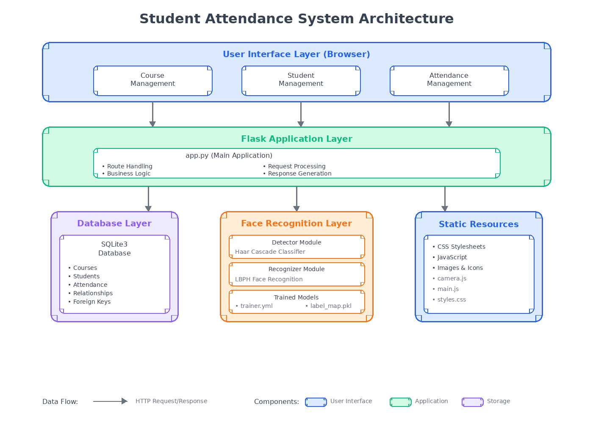
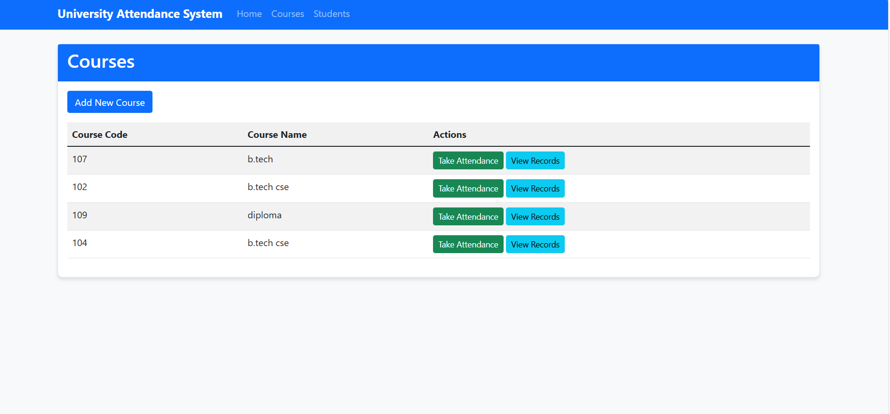

# 📸 Student Attendance System with Face Recognition

A Flask-based web application that leverages facial recognition technology to automate student attendance tracking. Built with OpenCV and machine learning, this system streamlines attendance management for educational institutions while ensuring accuracy and security.


---

## 📋 Table of Contents

- [Overview](#-overview)
- [Features](#-features)
- [Technology Stack](#-technology-stack)
- [System Architecture](#-system-architecture)
- [Installation](#-installation)
- [Usage Guide](#-usage-guide)
- [Project Structure](#-project-structure)
- [API Endpoints](#-api-endpoints)
- [Screenshots](#-screenshots)
- [Troubleshooting](#-troubleshooting)
- [Future Enhancements](#-future-enhancements)
- [License](#-license)

---

## 🌟 Overview

Traditional attendance systems are time-consuming, prone to errors, and vulnerable to proxy attendance. This project uses facial recognition technology to automate attendance tracking, reducing time from 10-15 minutes to 2-3 minutes per class with 95%+ accuracy.

### Key Benefits

| Challenge | Traditional Method | Our Solution |
|-----------|-------------------|--------------|
| **Time** | 10-15 minutes per class | 2-3 minutes |
| **Accuracy** | Human error prone | 95%+ accuracy |
| **Proxy Attendance** | Easy to fake | Biometric authentication |
| **Record Keeping** | Manual entry | Automated database |

---

## ✨ Features

### Core Functionality

- **🎓 Course Management**: Create and manage multiple courses with unique codes
- **👨‍🎓 Student Management**: Register students with roll numbers and personal information
- **📸 Face Registration**: One-click face capture with real-time camera integration
- **✅ Automated Attendance**: Real-time face recognition with <200ms processing time
- **📊 Reports & Analytics**: Daily summaries, course-wise tracking, and attendance percentages

### Technical Features

- **LBPH Algorithm**: Efficient Local Binary Patterns Histograms for face recognition
- **Haar Cascade**: Fast face detection (20-30 FPS)
- **SQLite Database**: Lightweight, embedded database for data persistence
- **RESTful API**: Clean endpoint design for potential integrations
- **Responsive UI**: Mobile-friendly interface with modern design

---

## 🛠 Technology Stack

### Backend

| Technology | Version | Purpose |
|------------|---------|---------|
| Flask | 2.0.1 | Web framework |
| OpenCV | 4.5.3 | Computer vision & face recognition |
| NumPy | 1.21.2 | Numerical computing |
| SQLite3 | 2.6.0 | Database |
| Python | 3.7+ | Core language |

### Frontend

- **HTML5**: Semantic markup and structure
- **CSS3**: Modern styling with animations
- **JavaScript (ES6+)**: WebRTC camera access and AJAX requests

### Machine Learning

- **Face Detection**: Haar Cascade Classifier
- **Face Recognition**: LBPH (Local Binary Patterns Histograms)
- **Model Training**: Incremental learning for new faces

---

## 🏗 System Architecture



The system follows a three-tier architecture:

1. **User Interface Layer** (Browser)
   - Course, Student, and Attendance Management interfaces
   - Real-time camera feed for face capture

2. **Application Layer** (Flask)
   - Route handling and business logic
   - Request processing and response generation

3. **Data Layer**
   - **Database**: SQLite3 for storing courses, students, and attendance
   - **Face Recognition**: Detector and recognizer modules with trained models
   - **Static Resources**: CSS, JavaScript, and images

---

## 🚀 Installation

### Prerequisites

- Python 3.7 or higher
- Webcam (built-in or external)
- pip package manager
- Git

### Quick Install

```bash
# 1. Clone repository
git clone https://github.com/pinkidagar18/Student-Attendence-System-.git
cd Student-Attendence-System-

# 2. Create virtual environment
python -m venv venv

# Activate (Windows)
venv\Scripts\activate

# Activate (Linux/Mac)
source venv/bin/activate

# 3. Install dependencies
pip install --upgrade pip
pip install -r requirements.txt

# 4. Install system dependencies (Linux only)
sudo apt-get update
sudo apt-get install -y libgl1-mesa-glx libglib2.0-0

# 5. Run application
python app.py
```

Access at: **http://127.0.0.1:5000**

### Troubleshooting Installation

**Issue: opencv 'face' module not found**
```bash
pip uninstall opencv-python
pip install opencv-contrib-python
```

**Issue: Camera permissions**
- Check browser settings → Privacy → Camera
- Use Chrome or Firefox (recommended)
- Ensure HTTPS or localhost

---

## 💻 Usage Guide

### Quick Start (5 Minutes)

1. **Add Course**: Navigate to "Manage Courses" → Enter CS101, Computer Science
2. **Add Student**: Go to "Manage Students" → Enter 2023001, John, Doe
3. **Register Face**: Click "Register Face" → Allow camera → Capture face
4. **Take Attendance**: Select course → Students face camera → Auto-recognition
5. **View Reports**: Click "View Summary" to see attendance records

---
### Detailed Workflow 
#### 1. Home Page


View color-coded reports (Green=Present, Red=Absent) with date filtering and attendance percentages.

#### 2. Course Management


Create courses with unique codes (e.g., CS101, MATH201). Best practice: Use department code + number format.

#### 3. Student Registration


Add students with roll numbers. Use consistent format like year + sequential number (2023001, 2023002).

#### 4. Face Registration


**Best Practices:**
- Center face in frame (60-80% coverage)
- Good, even lighting
- Remove glasses if causing glare
- Neutral expression
- Only ONE face visible

#### 5. Attendance Summary


Students queue and face camera one by one. System recognizes and marks automatically. Confirm each recognition before moving to next student.


---

## 📁 Project Structure

```
Student-Attendence-System/
│
├── app.py                      # Main Flask application
├── requirements.txt            # Python dependencies
├── attendance.db              # SQLite database (auto-created)
│
├── database/
│   ├── db_utils.py           # Database utilities
│   └── models.py             # Database models
│
├── face_recognition/
│   ├── detector.py           # Haar Cascade face detection
│   ├── recognizer.py         # LBPH face recognition
│   └── models/
│       ├── trainer.yml       # Trained model
│       └── label_map.pkl     # Student ID mapping
│
├── static/
│   ├── css/styles.css        # Styling
│   ├── js/
│   │   ├── camera.js         # Camera handling
│   │   └── main.js           # Main functions
│   └── img/                  # Images
│
└── templates/                 # HTML templates
    ├── base.html
    ├── index.html
    ├── courses.html
    ├── students.html
    ├── register_face.html
    ├── take_attendance.html
    └── attendance_summary.html
```


---

## 🔌 API Endpoints

| Endpoint | Method | Description |
|----------|--------|-------------|
| `/` | GET | Home page |
| `/courses` | GET | List courses |
| `/add_course` | POST | Create course |
| `/students` | GET | List students |
| `/add_student` | POST | Register student |
| `/register_face/<id>` | GET/POST | Face registration |
| `/take_attendance/<id>` | GET | Attendance page |
| `/recognize_face` | POST | Recognize face |
| `/record_attendance` | POST | Save attendance |
| `/attendance_summary/<id>` | GET | View reports |

### Example API Usage

**Recognize Face:**
```bash
curl -X POST http://127.0.0.1:5000/recognize_face \
  -F "image_data=data:image/jpeg;base64,..."
```

**Response:**
```json
{
  "status": "success",
  "student_id": 1,
  "student_name": "John Doe"
}
```

---


## 🔧 Troubleshooting

### Common Issues

#### 1. Model Loading Error
**Issue:** `FileNotFoundError: trainer.yml`

**Solution:**
```bash
mkdir -p face_recognition/models
# Models will be created on first face registration
```

#### 2. OpenCV Module Error
**Issue:** `AttributeError: module 'cv2' has no attribute 'face'`

**Solution:**
```bash
pip uninstall opencv-python
pip install opencv-contrib-python
```

#### 3. Camera Not Working
**Issue:** Browser doesn't access webcam

**Solutions:**
- Check browser permissions (Settings → Privacy → Camera)
- Use HTTPS or localhost (required by modern browsers)
- Close other apps using the camera
- Try Chrome or Firefox

#### 4. Face Not Detected
**Causes & Solutions:**
- **Poor lighting** → Use well-lit room, avoid backlighting
- **Face too small** → Move closer to camera (1-2 feet)
- **Multiple faces** → Ensure only one person in frame
- **Wrong angle** → Face camera directly, keep head level

#### 5. Wrong Student Recognized
**Causes:**
- Insufficient training data
- Changed appearance (haircut, beard, glasses)
- Different lighting conditions
- Threshold too lenient

**Solutions:**
```python
# Register multiple face samples
for i in range(5):
    train_recognizer(image, student_id)
    time.sleep(1)

# Adjust confidence threshold
CONFIDENCE_THRESHOLD = 60  # Stricter recognition
```

#### 6. Database Locked
**Issue:** `sqlite3.OperationalError: database is locked`

**Solution:**
```python
# Increase timeout
conn = sqlite3.connect('attendance.db', timeout=30.0)

# Enable WAL mode for better concurrency
conn.execute('PRAGMA journal_mode=WAL')

# Always close connections properly
try:
    # ... your code ...
finally:
    conn.close()
```

#### 7. Port Already in Use
**Issue:** `Address already in use: Port 5000`

**Solution:**
```bash
# Find and kill process (Linux/Mac)
lsof -i :5000
kill -9 <PID>

# Windows
netstat -ano | findstr :5000
taskkill /PID <PID> /F

# Or use different port
python app.py  # Then modify app.run(port=5001)
```

## 🔮 Future Enhancements

### Planned Features

**High Priority:**
- [ ] Multiple face recognition in single frame
- [ ] Analytics dashboard with attendance trends
- [ ] CSV/PDF export for reports
- [ ] Email notifications for low attendance
- [ ] Mobile application (iOS/Android)

**Medium Priority:**
- [ ] OAuth integration (Google, Microsoft)
- [ ] Cloud storage for face models
- [ ] API documentation with Swagger
- [ ] Multi-language support (i18n)
- [ ] Dark mode interface

**Advanced Features:**
- [ ] Deep learning models (FaceNet, ArcFace)
- [ ] Mask detection for COVID compliance
- [ ] LMS integration (Moodle, Canvas, Blackboard)
- [ ] Blockchain for immutable attendance records
- [ ] Voice commands and accessibility features

---

## 📄 License

This project is licensed under the **MIT License**.

---

---

## 📧 Contact & Support

### Maintainer

**Pinki Dagar**
- 📧 Email: pinkidagar18@gmail.com
- 🐙 GitHub: [@pinkidagar18](https://github.com/pinkidagar18)
- 🔗 Project: [Student Attendance System](https://github.com/pinkidagar18/Student-Attendence-System-)

---

## 📚 References

1. **Viola, P., & Jones, M.** (2001). "Rapid Object Detection using a Boosted Cascade of Simple Features"
2. **Ahonen, T., Hadid, A., & Pietikäinen, M.** (2006). "Face Description with Local Binary Patterns"
3. **Flask Documentation**: [flask.palletsprojects.com](https://flask.palletsprojects.com/)
4. **OpenCV Documentation**: [docs.opencv.org](https://docs.opencv.org/)
5. **GDPR Guidelines**: [gdpr-info.eu](https://gdpr-info.eu/)

---

## ⚠️ Important Notes

### Production Considerations

⚠️ **This system is designed for educational purposes and small-scale deployments (up to 100 students).**

**Before production use:**
1. Implement all security measures (HTTPS, authentication)
2. Ensure legal compliance (GDPR, consent forms)
3. Use production-grade infrastructure
4. Set up monitoring and logging
5. Implement automated backups
6. Conduct security audits
7. Load and stress testing

### Current Limitations

- Single face per frame for registration
- Recognition accuracy varies with lighting (75-95%)
- Requires frontal face view for best results
- Local deployment only (not cloud-ready)
- Tested with up to 100 students
- Basic authentication (no OAuth/SSO)

For large-scale deployments (500+ students), consider:
- PostgreSQL/MySQL database migration
- Distributed architecture
- Load balancing
- CDN for static resources
- Cloud deployment (AWS, Azure, GCP)


<div align="center">

**Made with ❤️ for better education through technology**


</div>
